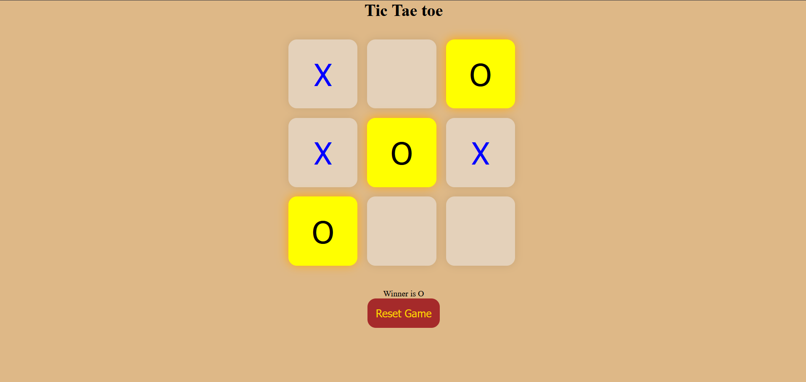

# ❌⭕ Tic-Tac-Toe Game

A simple and interactive **Tic-Tac-Toe** game built using **HTML, CSS, and JavaScript**. This project allows two players to compete in the classic 3×3 grid game with automatic winner detection, winning cell highlighting, and game reset functionality.

---

## 🚀 Live Demo

🔗 https://your-live-demo-link.com

---

## 📸 Preview



---

## ✨ Features

* ❌ Two-player gameplay (X vs O)
* 🎯 Automatic winner detection
* 🌟 Highlights the winning combination
* 🔄 Reset game with one click
* 🚫 Prevents overwriting occupied cells
* 🎨 Clean and responsive user interface
* ⚡ Smooth gameplay experience

---

## 🛠️ Built With

* HTML5
* CSS3
* JavaScript (ES6)

---

## 📂 Project Structure

```text
tic-tac-toe/
│
├── index.html
├── style.css
├── script.js
├── screenshot.png
└── README.md
```

---

## 🧠 What I Learned

This project helped me improve my understanding of:

* DOM Manipulation
* Event Handling
* JavaScript Functions
* Conditional Logic
* Arrays
* Game State Management
* Winner Checking Algorithms
* Responsive Web Design

---

## ▶️ Getting Started

1. Clone the repository

```bash
https://github.com/sairaj-086/tic-tac-toe
```

2. Open the project folder.

3. Open **index.html** in browser.

---

## 📌 Key Functionalities

✔ Two Player Mode

✔ Winner Detection

✔ Winning Cells Highlight

✔ Reset Game

✔ Responsive UI

✔ Interactive Gameplay

---

## 🚀 Future Improvements

* 🤖 Single Player Mode (AI)
* 🏆 Scoreboard
* 🤝 Draw Detection
* 🎵 Sound Effects
* 🌙 Dark Mode
* 🎨 Multiple Themes
* 📱 Better Mobile Animations
* 💾 Save Match History

---

## 👨‍💻 Author

**Sairaj**

Feel free to explore the project, suggest improvements, or contribute.

If you enjoyed this project, don't forget to ⭐ the repository!

